# Hello there 👋, I'm Husni

- 🔭 I'm an Site Reliability Engineer [@Accelbyte Inc](https://accelbyte.io/) and ex-System Engineer [@Tokopedia](https://www.tokopedia.com/)
- 🎋 Manage a personal project called [Project Garden](https://github.com/project-garden)
- 🌱 Currently learning Rust, Software Engineering, Software Architecture, and Computational Physics
- 👀 Interested in Cloud Computing, Software Engineering and Nuclear Engineering
- ⚡ Certificated on :
  - [x] [🌈👨‍💻 GCP Associate Cloud Engineer](https://www.credential.net/c2cbc5cd-b8ca-41fc-8417-f618631078e1)
  - [x] [🍊👨‍💻 AWS Developer Associate](https://www.credly.com/badges/a76fc573-ac7d-479a-a391-9b597b667850/public_url)
  - [ ] 🍊👷‍♂️ AWS Solution Architect Associate
  - [ ] ☸️👷‍♂️ K8S Certified Kubernetes Administrator
  - [ ] ☸️👨‍💻 K8S Certified Kubernetes Application Developer
- 📫 Reach me on LinkedIn [Husni Zuhdi](https://www.linkedin.com/in/husni-naufal-zuhdi/)

